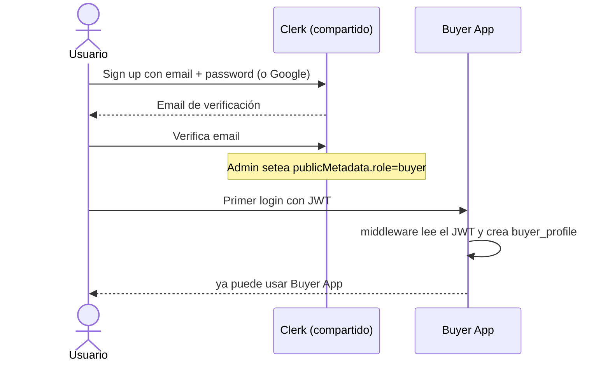
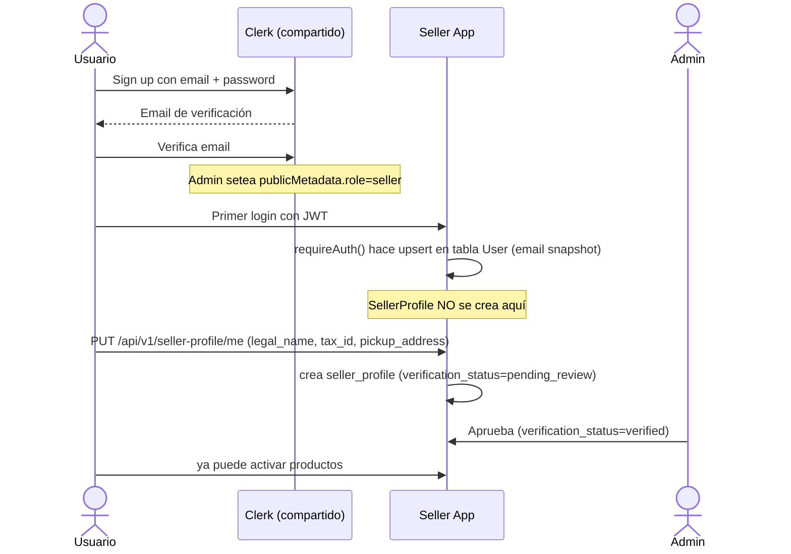
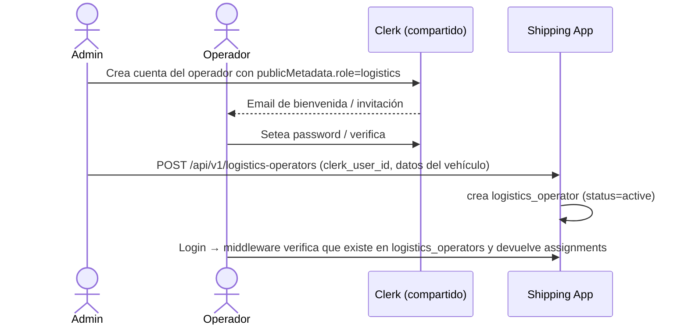
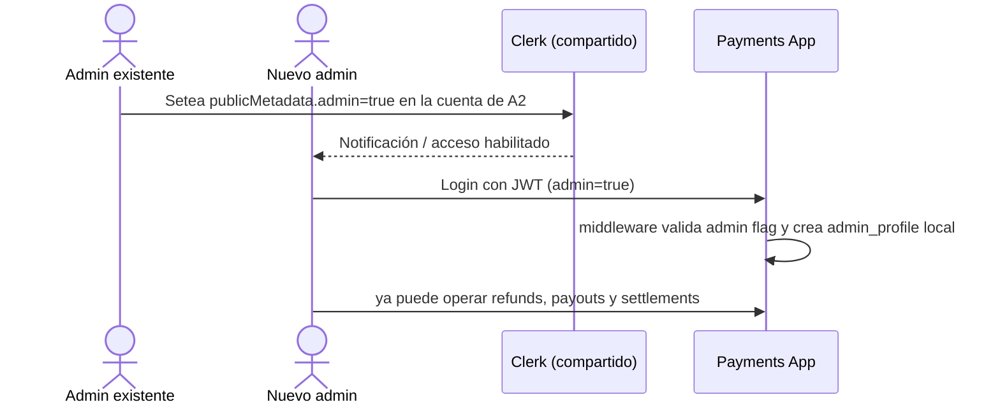

# 1.5 — Usuarios

> **Tipo C — Marketplace · BiciMarket**

---

## 1. Clerk compartido

Todas las apps de BiciMarket comparten **una única instancia de Clerk**. Hay un solo proyecto Clerk para todo el sistema.

| Concepto | Descripción |
|---|---|
| Instancia | Una sola (`bicimarket`) compartida por Buyer App, Seller App, Shipping App y Payments App |
| Rol del usuario | Determinado por `publicMetadata.role` en el JWT: `buyer` \| `seller` \| `logistics` |
| Flag admin | `publicMetadata.admin: true` (compatible con cualquier rol) |
| JWT | Todas las apps validan contra el mismo Clerk; el `clerk_user_id` (`sub`) identifica al mismo humano en todo el sistema |
| Multi-rol | Un mismo usuario puede tener varios perfiles en distintas apps (ej: alguien que vende y también compra) |

> Las vistas "Mis comprobantes" y "Mis liquidaciones" viven en Buyer App y Seller App respectivamente. Esas apps consumen los datos de Payments por REST con `X-Service-Token`; el usuario no se loguea en Payments.

---

## 2. Asignación de rol `admin`

`admin` es una flag transversal que se combina con el rol funcional. Se setea en Clerk Dashboard como `publicMetadata.admin = true`.

| App | Dónde aplica la flag admin |
|---|---|
| Buyer App | Acceso a `GET /admin/orders`, etc. |
| Seller App | Endpoints admin de Seller (verificación de perfiles, etc.) |
| Shipping App | Reasignaciones, cambio manual de status, alta de operadores logísticos |
| Payments App | La app rechaza cualquier JWT sin `publicMetadata.admin=true` — en esta app todos los usuarios deben ser admin |

Promoción a admin: la hace un admin existente vía Clerk Dashboard. Sin self-service.

---

## 3. Sincronización Clerk → DB local (provisioning perezoso, sin webhooks)

> **Decisión del proyecto**: no usamos webhooks de Clerk. Cada app sincroniza su perfil local **al momento del login**, leyendo el JWT validado y haciendo upsert en su DB. Es un trade-off conocido: los cambios hechos en Clerk Dashboard solo se reflejan cuando el usuario vuelve a loguearse, pero a cambio nos ahorramos un endpoint público con firma y todo el manejo de retry.

### 3.1 Cómo funciona

En el middleware de auth de cada app, antes de pasarle el request al controller:

1. Validar el JWT de Clerk → obtener `clerk_user_id`, `email`, `full_name`.
2. Buscar el perfil local por `clerk_user_id`.
3. Si no existe → crear (con los defaults que correspondan a la app).
4. Si existe pero `email` o `full_name` cambiaron respecto del JWT → actualizar el snapshot.
5. Continuar con el request normal.

> **Seller App — implementación real**: el helper `requireAuth()` (en `src/lib/api-utils.ts`) hace upsert del `email` en el modelo `User` (tabla auxiliar de sesión). Esto es intencional: mantiene un registro local del usuario autenticado independientemente del `SellerProfile`. El `SellerProfile` **no se crea automáticamente** en el primer login; el vendedor debe llamar a `PUT /api/v1/seller-profile/me` para crearlo explícitamente (ver §3.2 y §5.3).

Esto se hace en cada request, pero el costo es despreciable porque solo es un `SELECT` por `clerk_user_id` (índice único). Solo escribe cuando hay cambios reales.

### 3.2 Defaults al crear perfil

| App | Acción al primer login |
|---|---|
| Buyer | crea `buyer_profile` con `clerk_user_id`, `email`, `full_name`. Entra directo (no aplica `verification_status`). |
| Seller | **No crea `seller_profile` automáticamente.** Al primer login, `requireAuth()` hace upsert en la tabla `User` (email). El vendedor debe completar su perfil llamando a `PUT /api/v1/seller-profile/me`; hasta entonces, cualquier endpoint que requiera `SellerProfile` devuelve `404 SELLER_PROFILE_NOT_FOUND`. Una vez creado, el perfil queda con `verification_status=pending_review` y solo un admin puede pasarlo a `verified`. |
| Shipping | **no crea automáticamente**. Si el `clerk_user_id` no figura en `logistics_operators`, devuelve 403. Los operadores se crean por admin con `POST /api/v1/logistics-operators`. |
| Payments | crea `admin_profile` local en su DB **solo si** el JWT trae `publicMetadata.admin=true`. Sin flag admin, devuelve 403 y no crea nada. |

### 3.3 Soft delete

Cuando se borra una cuenta en Clerk, no nos enteramos automáticamente. Si hace falta, el admin elimina el perfil local manualmente, o se puede correr un cron diario que pregunte a la API de Clerk por `clerk_user_id`s que ya no existen y los soft-deletea. Para Etapa 1 basta con la limpieza manual.

---

## 4. Claims del JWT

El único Clerk emite tokens con la siguiente forma. Todas las apps validan contra la misma instancia.

**Claims requeridos (comunes a todas las apps):**

| Claim | Descripción |
|---|---|
| `sub` | `clerk_user_id`, identificador único del usuario |
| `email` | Email del usuario |
| `email_verified` | Debe ser `true` |
| `publicMetadata.role` | `buyer` \| `seller` \| `logistics` |
| `publicMetadata.admin` | `true` si es admin (opcional en Buyer/Seller/Shipping; obligatorio en Payments) |

**Validaciones adicionales por app (en backend, no en el JWT):**

| App | Validación extra |
|---|---|
| Seller | El `seller_profile` asociado debe estar `verified` para activar productos |
| Shipping | El `logistics_operator` asociado debe tener `status=active` |
| Payments | JWT sin `publicMetadata.admin=true` → 401, sin excepción |

Operaciones `admin` en cualquier app requieren `publicMetadata.admin === true`.

---

## 5. Estrategia de roles

### 5.1 Reglas

1. **El rol funcional viene en `publicMetadata.role`**. Se setea en Clerk Dashboard al crear o aprobar la cuenta. Sin ese claim, la app rechaza o trata al usuario como sin rol.
2. **Un humano = una cuenta Clerk** para todo el sistema. Puede tener perfiles en múltiples apps (ej: el mismo usuario puede ser comprador y vendedor).
3. **`admin` es transversal** y vive en `publicMetadata.admin = true`. En Payments es obligatoria; en las demás apps habilita endpoints de administración.
4. **El alta de seller no es libre**: el `seller_profile` se crea manualmente por el vendedor con `PUT /api/v1/seller-profile/me` y queda como `pending_review`; solo un admin lo pasa a `verified`. Hasta entonces no puede activar productos.
5. **El alta de operador logístico tampoco es libre**: requiere que un admin lo cree con `POST /api/v1/logistics-operators` y le asigne `publicMetadata.role=logistics` en Clerk.
6. **Buyers y sellers no se loguean en Payments App.** Para ver comprobantes entran a Buyer App; para ver liquidaciones entran a Seller App. Esas apps consumen los datos de Payments por REST con `X-Service-Token`.

### 5.2 Flujo de alta — Comprador



### 5.3 Flujo de alta — Vendedor



### 5.4 Flujo de alta — Operador logístico



### 5.5 Flujo de alta — Admin de Payments



---

## 6. Variables de entorno (Clerk)

Todas las apps usan las mismas claves del único Clerk del sistema:

```env
# Clerk compartido — mismas claves en todas las apps
NEXT_PUBLIC_CLERK_PUBLISHABLE_KEY=pk_live_…
CLERK_SECRET_KEY=sk_live_…
```

---

## Anexo — Cambios respecto de la versión anterior (`documentacion vieja/05-usuarios_VERSION_VIEJA.md`)

| Cambio | Qué era antes | Qué es ahora | Por qué cambió |
|--------|--------------|--------------|----------------|
| **Rol explícito en `publicMetadata.role`** | `metadata.role: "buyer / seller / operator / admin"` en el JWT | `publicMetadata.role`: `buyer` \| `seller` \| `logistics`; `publicMetadata.admin: true` como flag adicional | `publicMetadata` es el campo estándar de Clerk para datos de negocio no modificables por el usuario. Separar `role` de `admin` permite que un usuario sea seller y admin al mismo tiempo sin conflicto. |
| **Multi-rol formalizado** | "Un vendedor también puede comprar" — mencionado pero sin estructura | Explicitado en §5.1: un mismo `clerk_user_id` puede tener `buyer_profile` en Buyer App y `seller_profile` en Seller App simultáneamente | La versión vieja lo mencionaba implícitamente; la versión actual lo documenta como comportamiento esperado del sistema. |
| **Sincronización: lazy provisioning en vez de webhooks** | Webhook `user.created`/`user.updated` → cada app tenía `POST /api/webhooks/clerk` | Provisioning perezoso: el primer request autenticado crea el perfil local leyendo claims del JWT | Elimina la necesidad de un endpoint de webhook público con validación de firma y retry. Trade-off conocido: cambios en Clerk Dashboard se reflejan solo al próximo login. Aceptable para el alcance académico. |
| **Seller App: SellerProfile no se auto-crea en el primer login** | Implícito que el perfil se creaba automáticamente al primer login | `requireAuth()` hace upsert en tabla auxiliar `User` (intencional). `SellerProfile` **no se crea automáticamente**: el vendedor llama a `PUT /api/v1/seller-profile/me`. Hasta entonces los endpoints devuelven `404 SELLER_PROFILE_NOT_FOUND`. | Crear el perfil vacío automáticamente generaría registros con datos faltantes obligatorios (`legal_name`, `tax_id`, `pickup_address`). Mejor forzar que el vendedor los complete explícitamente. |
| **Alta de vendedor requiere aprobación de admin** | No documentado | `seller_profile` se crea con `verification_status=pending_review`; un admin lo pasa a `verified` antes de poder activar productos | Control de calidad del marketplace: evita publicaciones de cuentas sin verificar. |
| **Alta de operador logístico no es libre** | No documentado | Admin crea `POST /api/v1/logistics-operators` y asigna `publicMetadata.role=logistics` en Clerk | Los operadores tienen acceso a datos de envío de terceros; no deben poder registrarse solos. |
| **Payments App: solo admins** | Payments tenía usuarios finales | Payments App solo acepta JWT con `publicMetadata.admin=true`. Buyers y sellers ven sus datos en sus propias apps consumiendo Payments por REST | Simplifica Payments: no gestiona usuarios finales. Las apps fuente renderizan las vistas de usuario. |
